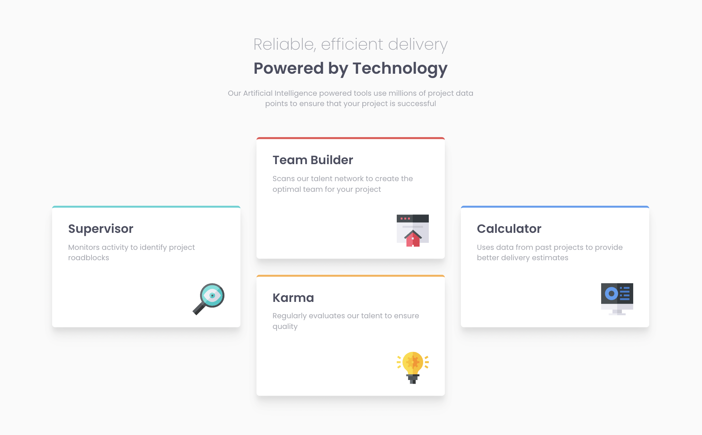

# Frontend Mentor - Four card feature section solution

This is Max Ruuen's solution to the [Four card feature section challenge on Frontend Mentor](https://www.frontendmentor.io/challenges/four-card-feature-section-weK1eFYK). Frontend Mentor challenges help you improve your coding skills by building realistic projects. 

## Table of contents

- [Overview](#overview)
  - [The challenge](#the-challenge)
  - [Screenshot](#screenshot)
  - [Links](#links)
- [My process](#my-process)
  - [Built with](#built-with)
  - [What I learned](#what-i-learned)
  - [Continued development](#continued-development)
- [Author](#author)

## Overview

### The challenge

Users should be able to:

- View the optimal layout for the site depending on their device's screen size

### Screenshot



### Links

- Solution URL: [Frontendmentor.io](https://www.frontendmentor.io/solutions/four-card-feature-section-in-css-grid-c5DTWwAFz)
- Live Site URL: [Netlify](https://rd-challenge-four-card-feature.netlify.app/)

## My process

### Built with

- HTML5
- SASS
- CSS Grid
- BEM-like syntax

### What I learned

This challenge gave me the change to further practice my CSS Grid knowledge, but it didn't test it too much as I have performed this style of grid layout before in previous projects.

I had a lot of fun working with layered shadows on the card elements to create better looking & more consistent element shadows - this is an area that I really want to spend further time on as a polished skill, but it's not completely essential; my ability to build websites/apps won't entirely depend on how good my shadow styles are.

Thanks to [Tobias Ahlin](https://tobiasahlin.com/blog/layered-smooth-box-shadows/) & [Josh Comeau](https://www.joshwcomeau.com/css/designing-shadows/) for their amazing resources on layered box shadows in CSS.

An example of the shadows I used for these card elements is below:
```css
box-shadow:
        0 8px 8px rgba(0,0,0,0.05),
        0 16px 16px rgba(0,0,0,0.05),
        0 24px 24px rgba(0,0,0,0.02);
```

This challenge also reminded me how much I love the `grid:` shorthand for declaring layout setup and grid area names:
```css
/* Using grid shorthand to generate 3 equal columns and 2 equal rows, each with separate area names. */
/* This allows you to easily define conjoined grid areas alongside single grid items */
.card__group {
  grid: 
    "left middletop right" auto 
    "left middlebottom right" auto /
    1fr 1fr 1fr;
}

/* Each grid item is then assigned to a grid area by name */
.card__supervisor {
    grid-area: left;
}

.card__team-builder {
    grid-area: middletop;
}

.card__karma {
    grid-area: middlebottom;
}

.card__calculator {
    grid-area: right;
}
```

### Continued development

I need to practice controlling the size of elements better, as I did have a hard time ensuring that all the boxes remain the same height regardless of content that is within it, but also not trying to use an absolute size value as well to ensure scaling.

I also need to spend more time playing around with layered shadows, as I feel that the shadows I used could be made a bit smoother.

Finally I want to spend more time understanding the proper recommended BEM naming conventions, but I am getting closer to my class names being good!

## Author

- Frontend Mentor - [@ruuendigital](https://www.frontendmentor.io/profile/ruuendigital)
- Twitter - [@maxruuen](https://www.twitter.com/maxruuen)
